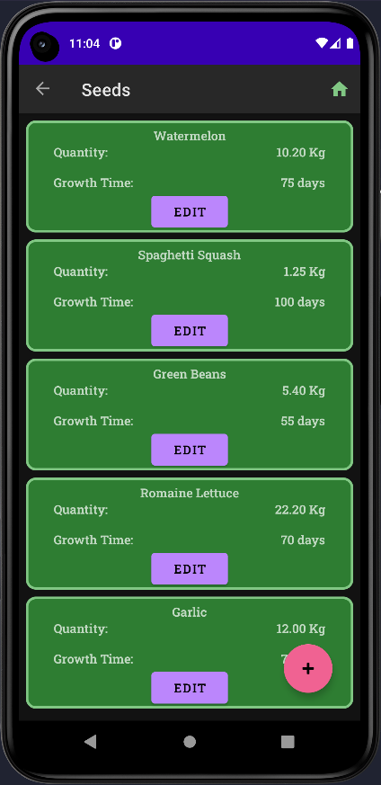
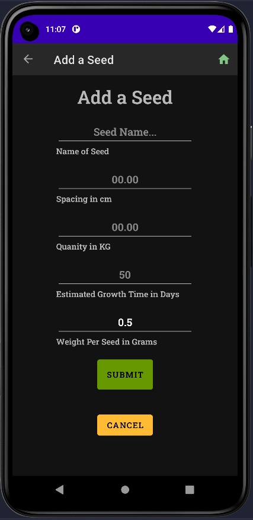
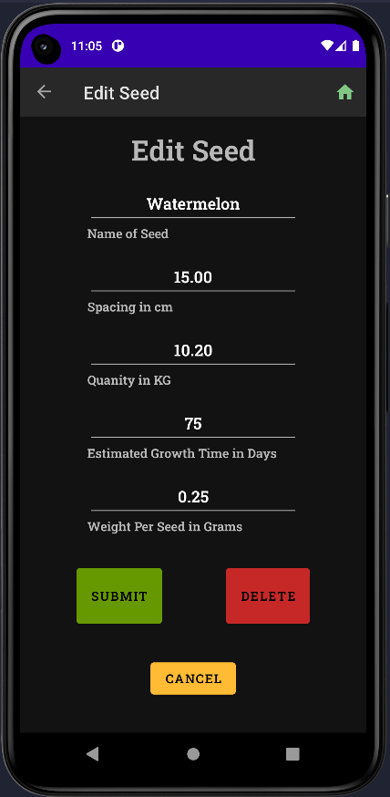
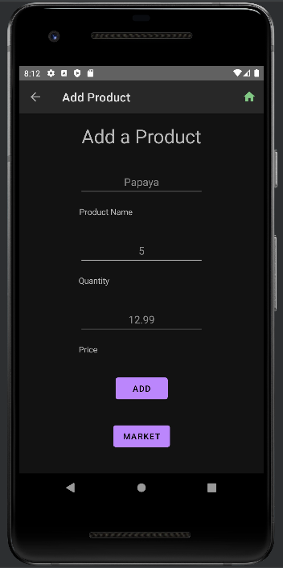
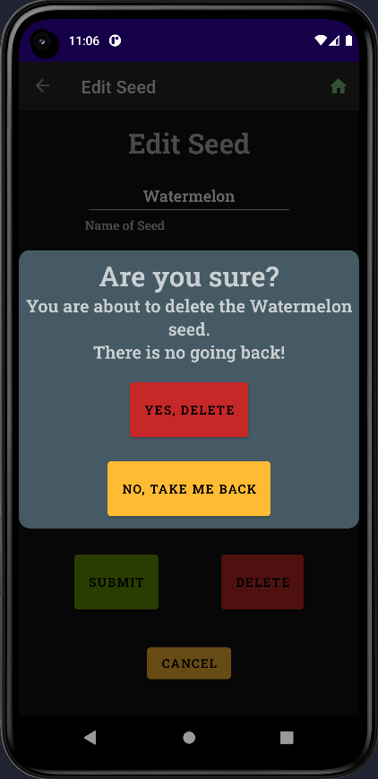
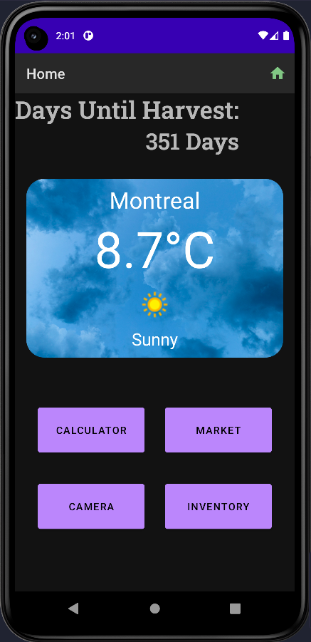
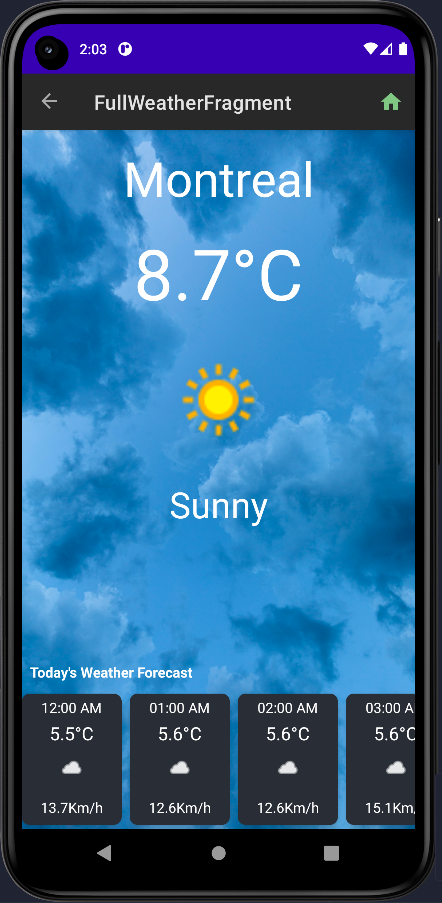
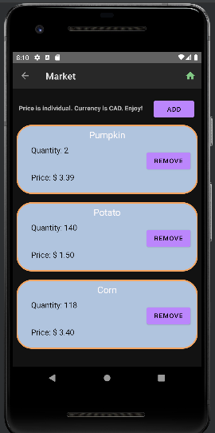

# **Farmerverse**

Farmerverse is an inventory management and general farming aid for farmers built in Java with Android Studio.

This application was built for our Application Development 2 class at John Abbott College in our 5th semester.

Built by: Samuel Anderson, Emmanuelle Oleszczuk, Kevin-Christopher Laskai, and Julian Hernandez Delgado

Links:

[Features](#features) - 
[References](#references) - 
[Credits](#credits)

## _Features_

### **Camera**

### **Seed Inventory Tracker**

## ****View Your Inventory in real time****

## ****Add a Seed****

## ****Edit a Seed****

## ****Add a Product****

## ****Custom Delete... Just in case****

### **Custom Notifications**

### **Weather Forecast**

## ****Live Weather on the Home Screen****

## ****Click on the widget for an Hour by Hour view****

### **Farmers Marketplace**

### **Countdown to Harvest**

## _References_

<!-- Put links here -->
Weather Inspired by [this](https://www.youtube.com/watch?v=q7NF-2gtfEU) youtube video by GeeksForGeeks. It was customized to suit our specific needs.

---

Weather API calls made to [weatherapi](https://www.weatherapi.com/).

---

Database was made using [Room](https://developer.android.com/training/data-storage/room).

---

## _Credits_
Made by:  
[Samuel Anderson](https://sanderson-96.github.io) 
[Kevin-Christopher Laskai]() 
[Emmanuelle Oleszczuk]() 
[Julian Hernandez Delgado](https://github.com/julian-hzd) 
